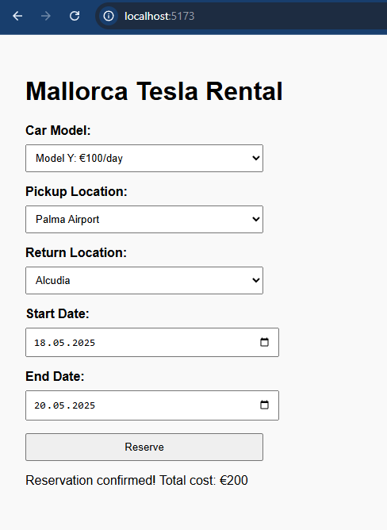
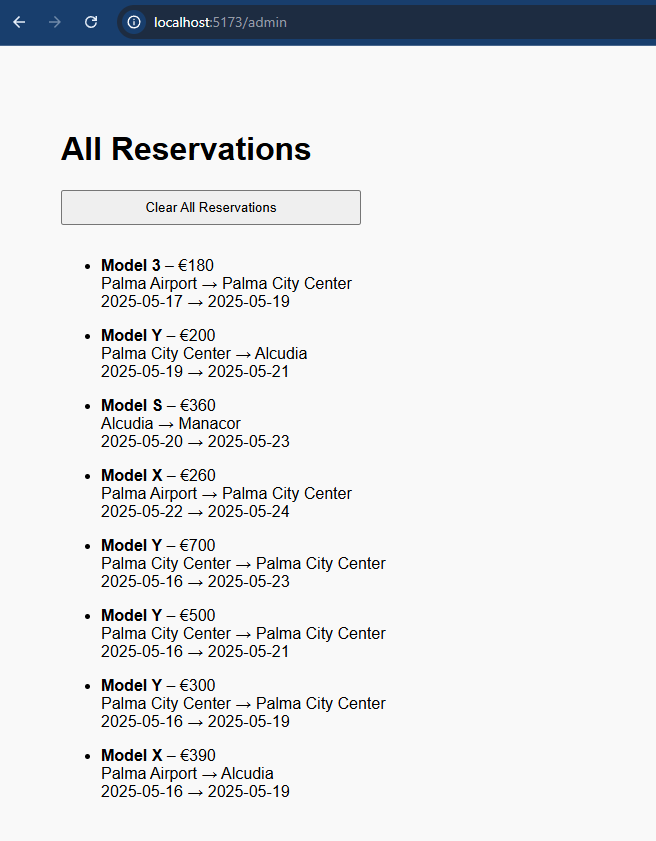
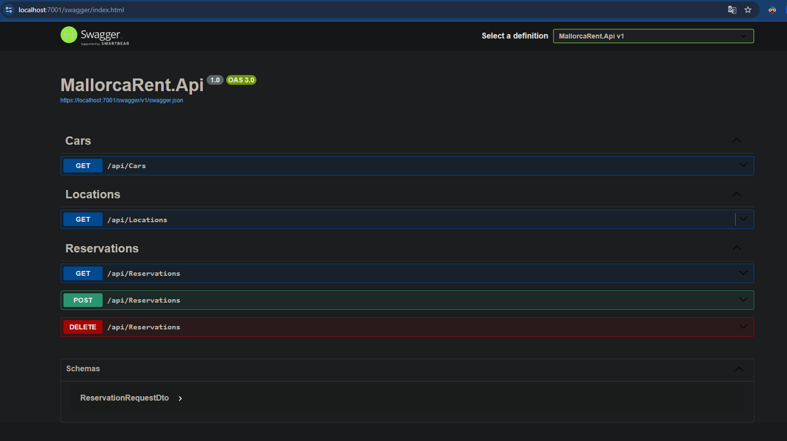

# MallorcaRent

A full-stack web application for renting Tesla cars in Mallorca. Built as part of a recruitment task.

---

## Project Overview

The application allows users to create a Tesla car reservation by selecting:
- the car model,
- pickup and return locations (Palma Airport, Palma City Center, Alcudia, Manacor),
- a date range.

The backend calculates the total cost based on the selected car’s daily price and the number of days.

---

## Assumptions

- All current Tesla passenger models are available except the Tesla Semi.
- Prices per day are hardcoded for now (e.g., Model 3: €90, Model Y: €100, etc.).
- Date range is interpreted as **full days** between start and end date.
- The same location can be used for pickup and return.
- SQLite is used for simplicity in local testing.
- CORS is enabled only for `http://localhost:5173`.

---

## Features

### User-facing
- Create a new reservation (form with validation)
- Calculates and displays total cost
- Feedback message after reservation

### Admin Panel
- List all reservations
- Delete any reservation
- (Planned: filtering, summary stats, editing)

---

## Tech Stack

| Layer      | Technology                          |
|------------|--------------------------------------|
| Frontend   | React (Vite, TypeScript)             |
| Backend    | ASP.NET Core 8.0 Web API             |
| Database   | SQLite via EF Core                   |
| Styling    | CSS (basic layout)                   |
| API        | REST, CORS-enabled                   |
| Seed Data  | Cars, locations, sample reservations |

---

## How to Run

### 1. Backend

```bash
cd MallorcaRent
dotnet run
```

Swagger UI:
```bash
https://localhost:7001/swagger
```

---

### 2. Frontend

```bash
cd frontend
npm install
npm run dev
```

App runs at:
```bash
http://localhost:5173
```

Make sure `.env` is set:
```bash
VITE_API_URL=https://localhost:5000/api
```

---

## Folder Structure

```bash
MallorcaRent/
├── MallorcaRent.Api/           # ASP.NET Core backend
├── MallorcaRent.Application/  # DTOs, interfaces
├── MallorcaRent.Domain/       # Domain entities
├── MallorcaRent.Infrastructure/ # EF Core, seed, migrations
├── frontend/                    # React app (Vite + TS)
```

---

## Next Steps

- Add notification toasts 
- Add sorting/filtering in admin view 
- Add editing existing reservations  

---

## Tests

Integration tests for API controllers using in-memory EF Core.

- Covers Cars, Locations, Reservations
- Tests both valid and invalid requests
- Run with `dotnet test`

## Screenshots

### Reservation Form


### Admin Panel


### API – Swagger UI


---

## Author

This project was implemented as part of a recruitment task.  
Technically structured, minimal UI, code-focused – as requested.
